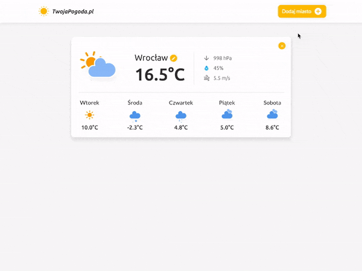
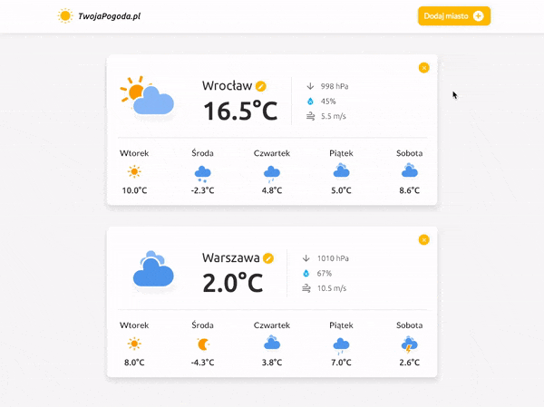

# YourWeather.com

The aim of the workshop is to prepare a weather application that obtains data from public APIs. The first step is to study the project structure, file layout, API documentation and the HTML file.


To install the project use the `npm install` command. Next, type `npm start`. If you want to build a project (so that the output files are created) you must use the `npm run build` method that will create a `build` catalog.

### Project structure:

```
src
  -- classes (directory for js files)
  -- styles (directory for scss files)
  app.js (the main js file)

images
  -- icons (icons for the project)

index.html (the main file of the application)
```


## Guidelines
In the application, we should be able to find the coordinates of a specific place and, based on these data, display the current and forecasted weather. We want to display all the necessary information:

- Current temperature
- Humidity
- Pressure
- Wind speed
- 5-day weather forecast


In this workshop you should use all ES6 attributes, such as declaring variables with `const`, `let`, `class` constructions, arrow functions, etc. Higher-order functions will also be useful.

In the `src/classes` catalog there are `Weather.js`, `IPLocating.js`, and `GeoLocating.js` files. They have appropriate classes that should be used as bases for downloading information about the weather, location based on the IP address or location based on the value entered into the text field.


## Operating principles

### Entering the website
After entering the site, you should send a query to the `IPLocating` API to download the current location based on your IP address. If you succeed, send another query but this time to the `DarkSky` site to download current weather and display it to the user.


### Adding a new city
The site has a "Add city" button. After clicking it, you should display the hidden section with the form. After the user has entered the city or the entire address, make queries to `GeoLocating` API to download the latitude and longitude. If it works, send another query to the `DarkSky` site to download current weather and display it to the user. After the data has been downloaded, the form should disappear.




### Hiding/Removing a module
Clicking the "x" button in the upper right corner of each module should hide the module. If it is the weather module, you can remove it from the HTML structure.




## Useful information

### CORS
Some of the API services (DarkSky) use [CORS](https://www.codecademy.com/articles/what-is-cors) that will prevent you from sending a query when you are using the unencrypted `localhost`. To avoid this, you must use:

```
https://cors-anywhere.herokuapp.com/
```

This address should be placed in front of the entire URL that we want to get to, e.g.

```
https://cors-anywhere.herokuapp.com/https://api.darksky.net/forecast/123-456-789/17.123,52.312?units=si&lang=pl
```

### Page loading effect
Add the `loading` class to the `body` element klasę and a spinner will appear in full screen which you have seen on the recordings above. To remove it, just remove the `loading` class from the `body` element.


### Icons
In the project we have installed weather icons that you can find in the `images/icons` catalog.  

Additionally, you can use the Material-Icons. You will find a list here: https://material.io/tools/icons.  
We use them with an i tag:

```html
<i class="material-icons">icon_name</i>
```

## API

### IPLocating
The http://ip-api.com/ site allows you to get the current location based on our IP address. Interestingly, you do not need to know it yourself. Just send a `GET` request to `http://ip-api.com/json/` and in response you will get a `JSON` object with our location data.

```json
{
  "query": "84.258.81.242",
  "status": "success",
  "country": "Poland",
  "countryCode": "PL",
  "region": "WP",
  "regionName": "Greater Poland",
  "city": "Ostrów Wielkopolski",
  "zip": "63-400",
  "lat": 51.6468,
  "lon": 17.8108,
  "timezone": "Europe/Warsaw",
  "isp": "Przedsiebiorstwo Promax Sp. J.",
  "org": "",
  "as": "PROMAX"
}
```


### GeoLocating
**An API key is required.**

**Attention!** You can encounter problems with obtaining an API key. GraphHopper blocks simultaneous registrations from the same IP address. If you can register, please send your key on Slack so that the rest of the group can use this service as well.

This API allows you to extract information about the latitude and longitude based on the parameter entered, e.g. the Polish city "Wroclaw". You will get the information you see below in response to such query.

You need to register and then in the "Api Keys" tab, generate your key and save it in the project.

[GraphHopper Directions API with Route Optimization](https://graphhopper.com)  
Extracting location of a specific address: https://graphhopper.com/api/1/geocode?key=wasz_klucz&q=wroclaw

Replace `wroclaw` with whatever the user has typed in the text field of your application.

Response:
```json
{
    "hits": [
        {
            "osm_id": 2805690,
            "osm_type": "R",
            "extent": [
                16.8073393,
                51.2100604,
                17.1762192,
                51.0426686
            ],
            "country": "Poland",
            "osm_key": "place",
            "osm_value": "city",
            "name": "Wroclaw",
            "state": "Lower Silesian Voivodeship",
            "point": {
                "lng": 17.0326689,
                "lat": 51.1089776
            }
        }
	  ]
}
```

### Darksky
An API responsible for providing us with current and forecasted weather.
You need to register, generate your key and save it in the project.
Getting the key: https://darksky.net/dev  
Downloading the weather forecast: https://api.darksky.net/forecast/key/latitude,longitude?units=si&lang=pl

- Substitute `key` with the key generated by DarkSky
- Substitute `latitude` with `lat` value extracted from GraphHopper or IP-API
- Substitute `longitude` with `lng` value extracted from GraphHopper or IP-API
